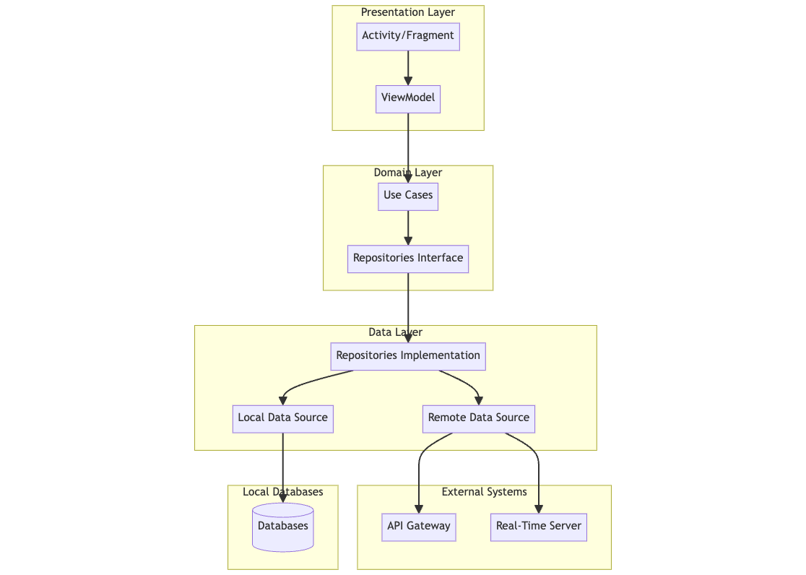

### Architecture Overview

The system design for the real-time quiz feature uses Clean Architecture with the MVVM pattern. This approach separates concerns into distinct layers, making the app scalable, maintainable, and testable. The main layers are Presentation, Domain, and Data, with interactions managed through interfaces and use cases.

### Component Diagram

#### Presentation Layer
- **Activity/Fragment**: The UI components that users interact with. They handle user input and render the UI.
- **ViewModel**: Manages UI-related data in a lifecycle-conscious way. It handles the interaction with the domain layer and updates the UI state.

#### Domain Layer
- **Use Cases**: Contain the business logic of the application. They define the application's operations and coordinate the flow of data between the presentation and data layers.
- **Repositories Interface**: Define the contract for data operations. They abstract the data source and provide a clean API for use cases.

#### Data Layer
- **Repositories Implementation**: Implement the repository interfaces. They manage data operations from local and remote sources, encapsulating the logic for accessing the data.
- **Local Data Source**: Handles data persistence on the device (e.g., using SQLite, Room).
    - **Databases**: Store persistent data such as user profiles, quiz questions, and leaderboard information.
- **Remote Data Source**: Manages network operations (e.g., making API calls, handling WebSocket connections).

#### External Systems
- **API Gateway**: Handles REST API requests and responses. It routes requests to appropriate backend services.
- **Real-Time Server**: Manages WebSocket connections for real-time communication between clients and the server.

### Component Responsibilities

1. **User Interface (Activity/Fragment)**
   - Display quiz questions, collect answers, and show the leaderboard.
   - Trigger actions in the ViewModel based on user interactions.

2. **ViewModel**
   - Maintain UI state and manage communication between the UI and the domain layer.
   - Execute use cases and update the UI with the results.

3. **Use Cases**
   - Contain the application's business logic.
   - Define methods to handle joining a quiz, submitting answers, and updating the leaderboard.

4. **Repositories**
   - Abstract the data source, providing a clean API for data operations.
   - Implement methods to interact with local and remote data sources.

5. **Local Data Source**
   - Handle data persistence locally on the device using SQLite, Room, or SharedPreferences.

6. **Remote Data Source**
   - Handle network operations, such as sending requests to the API Gateway and managing WebSocket connections.

### Technologies and Tools

- **Presentation Layer**: Android UI components (Activity, Fragment), ViewModel (Android Architecture Components).
- **Domain Layer**: Kotlin for business logic and use cases.
- **Data Layer**: Room for local database, Retrofit for REST API, and WebSocket for real-time communication.
- **External Systems**: Backend services hosted on a cloud platform, such as AWS or Firebase, to manage authentication, quiz sessions, and real-time updates.
