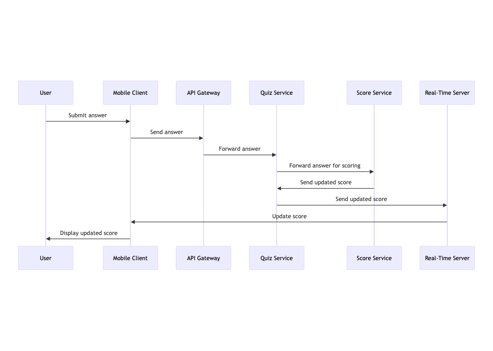

### Background

The task is to create a technical solution for a real-time quiz feature for an English learning mobile application. This feature aims to enhance user engagement by allowing users to answer questions in real-time, compete with others, and see their scores updated live on a leaderboard.

### Requirements

**Must-Have:**
- Users should be able to join a quiz session using a unique quiz ID.
- The system should support multiple users joining the same quiz session simultaneously.
- As users submit answers, their scores should be updated in real-time.
- A leaderboard should display the current standings of all participants and update promptly as scores change.
- The scoring system must be accurate and consistent.
- The solution must be optimized for mobile platforms.

**Should-Have:**
- The quiz session should handle high concurrency with minimal latency.
- User authentication and authorization mechanisms to ensure secure access to quiz sessions.
- Detailed logging and monitoring of quiz sessions for troubleshooting and analytics.

**Could-Have:**
- Integration with external educational content providers for dynamically generating quiz questions.
- Ability to handle different types of questions (e.g., multiple choice, true/false, fill-in-the-blank).

**Won't-Have:**
- The initial version will not support web-based access; it will focus solely on mobile platforms.

### Architecture Diagram

#### Component Descriptions

1. **Mobile Client**: The mobile application that users interact with to join quizzes, answer questions, and view the leaderboard.
2. **API Gateway**: Serves as the entry point for all client requests, routing them to the appropriate services.
3. **Authentication Service**: Manages user authentication and authorization to ensure secure access to quiz sessions.
4. **Quiz Service**: Manages quiz sessions, including starting and ending sessions, and handling user participation.
5. **Real-Time Communication Service**: Handles real-time updates and communication between the server and clients using WebSocket connections.
6. **Score Service**: Calculates and updates user scores in real-time as answers are submitted.
7. **Leaderboard Service**: Manages the leaderboard, updating it promptly as scores change.
8. **Question Database**: Stores quiz questions and related data.
9. **Leaderboard Database**: Stores leaderboard data, including user scores and rankings.
10. **Real-Time Server**: Facilitates WebSocket connections to provide real-time updates to the clients.

### Data Flows

1. **Joining a Quiz**: 

    
    - Users join a quiz session by entering a unique quiz ID in the Mobile Client.
    - The Mobile Client sends a request to the API Gateway.
    - The API Gateway authenticates the user via the Authentication Service.
    - Upon successful authentication, the request is forwarded to the Quiz Service.
    - The Quiz Service adds the user to the quiz session and establishes a WebSocket connection via the Real-Time Server for real-time updates.

2. **Submitting Answers**: 

    
    - Users submit their answers through the Mobile Client.
    - The Mobile Client sends the answer to the API Gateway.
    - The API Gateway forwards the request to the Quiz Service.
    - The Quiz Service processes the answer and forwards it to the Score Service.
    - The Score Service calculates the score and updates it in real-time.
    - The updated score is sent back through the Real-Time Server to the Mobile Client.

3. **Real-Time Leaderboard Updates**: 

    
    - The Score Service updates the user's score in the Leaderboard Database.
    - The Leaderboard Service retrieves the updated leaderboard data and sends it through the Real-Time Server.
    - The Real-Time Server updates the Mobile Client with the latest leaderboard standings.

### Technologies and Tools

- **Mobile Client**
    - Any Native or Cross-platform Frameworks like React-Native or Flutter.
    - Web-socket client for real-time communication.
- **API Gateway**: any REST API Framework
- **Real-Time Communication Service**: Utilizes WebSocket protocol for real-time communication.
- **Leaderboard Service**: Built using a high-performance database like Redis for quick updates and retrieval.
- **Databases**: 
    - **Question Database**: Uses a relational database like PostgreSQL or a NoSQL database like MongoDB.
    - **Leaderboard Database**: Uses Redis for fast read/write operations.
